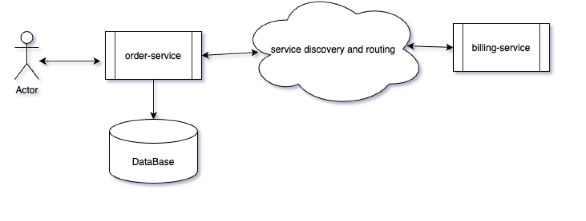

== chaos-monkey-billing-service 

This projects helps demonstrate the chaos monkey for Spring Boot/Java apps developed in micro-services style.
This is second of the 2 services BillingService to demo the SpringBoot Chaos Monkey as per the following design.

Order-Service makes a HTTP call to billing-service using  HTTP client.




Please read more here : https://bawa-simar.medium.com/developing-resilient-springboot-jvm-applications-with-chaos-engineering-applications-embracing-5ee063e7a119

----
Java 
SpringBoot 
----

The code for order-service in this figure can be found at : https://github.com/sdbawa/chaos-monkey-order-service

== What you'll build
You'll build Spring Boot app in Java, Spring Boot, and H2 DB that spins the following 2 services. 

----
POST http://localhost:8081/billing-svc/process-billing-for-order

{
    "orderId":1,
    "orderDetails": "just a new order"
}
----


== What you'll need

```
java_version: 11
spring-boot : 2.4.3
